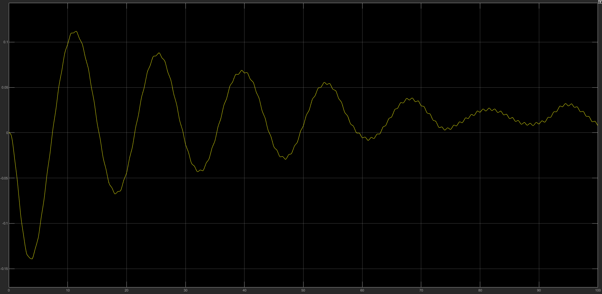

# Sprawozdanie 

Oliwer Lisek 188947 

Kewin Trochowski 188860 

### Treść zadania:


### Problem matematyczny:
Zadanie rozpoczęliśmy od zapisania modelu matematycznego układu fizycznego. A następnie zapisanie go w odpowiedniej formie aby móc przedstawić jego działanie już w samym programie.


### Realizacja programu 

Zapisaliśmy równania oraz dodaliśmy pewne wartości dla zmiennych: 

Stałe:
```
k1 = 5
k2 = 5
m1 = 10
m2 = 10
b1 = 5

f = 1
A = 1
T = 100
Fs = 10000
phase_shift = 0
```

Równania różniczkowe:
```
x2 += dt * x4
        x1 += dt * x3
        x4 += dt * diff_eq2(x1, x2, x3, x4, u)
        x3 += dt * diff_eq1(x1, x2, x3, x4)
```
```
def diff_eq1(x1, x2, x3, x4):
    return (k1 * (x2 - x1) + b1 * (x4 - x3)) / m1


def diff_eq2(x1, x2, x3, x4, u):
    return (k2 * (u - x2) + k1 * (x1 - x2) + b1 * (x3 - x4)) / m2
```

Na wejście układu podawany jest jeden z 3 sygnałów: prostokątny, trójkątny i sinusoidalny.
Sygnały tworzone są jako obiekt klasy 'Signals' i generowany przez wywołanie odpowiedniej funkcji, która zapisuje wyniki do listy.

```commandline

class Signals:
    def __init__(self, f, A, T, Fs, phase_shift=0):
        self.f = f
        self.A = A
        self.T = T
        self.Fs = Fs
        self.samples = []
        self.phase_shift = phase_shift

    def create_square_wave(self):
        N = self.Fs * self.T
        for i in range(N):
            t = i * 1 / Fs
            if t % (1 / f) < (1 / (f * 2)):
                self.samples.append(-A)
            else:
                self.samples.append(A)

    def create_sin_wave(self):
        N = self.Fs * self.T
        for i in range(N):
            t = i * 1 / Fs
            self.samples.append(math.sin(2 * math.pi * self.f * t + self.phase_shift))

    def create_triangle_wave(self):
        N = self.Fs // self.f // 4

        for i in range(self.f * self.T):
            for a in (1, -1):
                for j in range(N):
                    self.samples.append(j * (self.A / N) * a)
                for j in range(N):
                    self.samples.append((self.A - (j * (self.A / N))) * a)
```

Położenie 'x' oraz 'y' również zapisywane są do osobnych list.

Na koniec tworzone są wykresy za pomocą biblioteki Matplotlib.

## Sprawdzenie poprawności wyników

Poprawność wykresów sprawdziliśmy przy użyciu programy Matlab.

Wykresy 'x' od czasu dla trzech pobudzeń uzyskane za pomocą naszego kodu:


Dla sprawdzenia wykres x od t dla pobudzenia sygnałem prostokątnym w matlabie:


Wykresy 'y' od czasu dla trzech pobudzeń uzyskane za pomocą naszego kodu:


Dla sprawdzenia wykres y od t dla pobudzenia sygnałem sinusoidalnym w matlabie:

